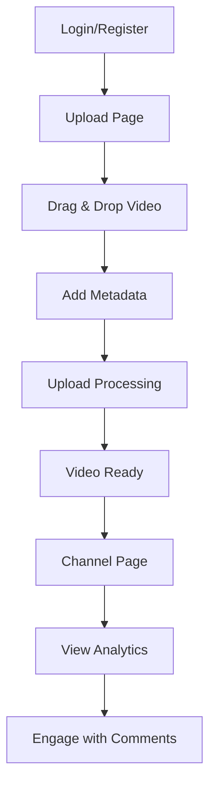
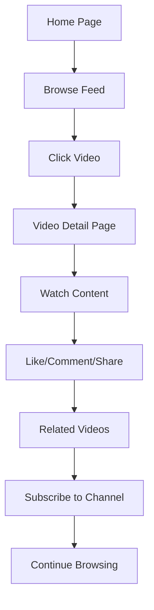
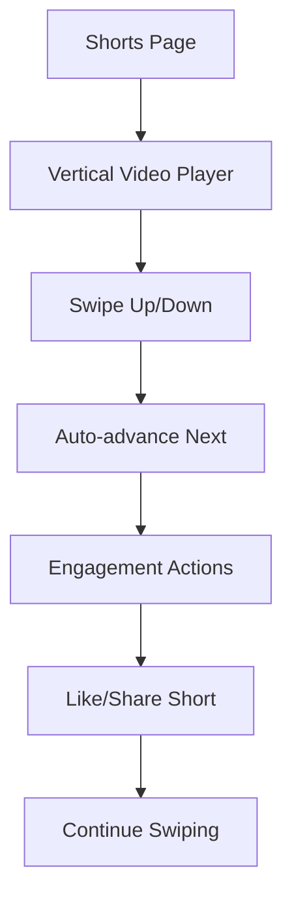

## 1. Product Overview
This project involves creating a new dedicated YouTube application by migrating all video functionality from the existing web project's mux implementation. The goal is to establish a completely independent video platform while maintaining feature parity and ensuring clean separation between the chat application and video platform.

The YouTube clone will replicate all existing video features including uploads, playback, shorts, and analytics, but operate as a standalone application with its own architecture and deployment pipeline.

## 2. Core Features

### 2.1 User Roles
| Role | Registration Method | Core Permissions |
|------|---------------------|------------------|
| Video Viewer | Email registration | Browse videos, watch content, like/comment |
| Content Creator | Email registration + verification | Upload videos, manage channel, view analytics |
| Admin | Admin panel assignment | Moderate content, manage users, system settings |

### 2.2 Feature Module
The YouTube application requirements consist of the following main pages:
1. **Home page**: Video feed, trending content, category navigation, search functionality
2. **Video detail page**: Video player, related videos, comments section, like/share actions
3. **Upload page**: Drag-and-drop upload, metadata input, thumbnail selection, processing status
4. **Shorts page**: Vertical video feed, swipe navigation, engagement actions
5. **Channel page**: User profile, video library, subscriber count, channel analytics
6. **Search page**: Advanced filtering, category browsing, search results with pagination

### 2.3 Page Details
| Page Name | Module Name | Feature description |
|-----------|-------------|---------------------|
| Home page | Video feed | Display trending and recommended videos with infinite scroll. Load more videos as user scrolls. |
| Home page | Category navigation | Filter videos by categories like Gaming, Music, Education, Entertainment. Persist user preferences. |
| Home page | Search bar | Real-time search with debouncing. Search by title, description, tags, and creator name. |
| Video detail | Video player | Custom player with quality selection, speed controls, fullscreen, and keyboard shortcuts. |
| Video detail | Related videos | Show related content based on category, tags, and viewing history. Display view counts and duration. |
| Video detail | Engagement actions | Like/unlike videos, share to social platforms, add to playlists, report inappropriate content. |
| Video detail | Comments section | Nested comments with replies, timestamps, user avatars, and moderation flags. |
| Upload page | File upload | Drag-and-drop interface with file validation (128MB limit, MP4/MOV/AVI support). |
| Upload page | Metadata input | Title, description, category selection, thumbnail upload, visibility settings (public/private). |
| Upload page | Processing status | Real-time upload progress, encoding status, thumbnail generation, and error handling. |
| Shorts page | Vertical player | Mobile-optimized vertical video player with swipe gestures for navigation. |
| Shorts page | Engagement overlay | Like, comment, share buttons overlaid on video with smooth animations. |
| Shorts page | Auto-advance | Automatically play next short after current video ends with seamless transitions. |
| Channel page | Profile header | Channel banner, avatar, subscriber count, and subscribe button with toggle functionality. |
| Channel page | Video library | Grid layout of uploaded videos with sorting options (newest, most viewed, most liked). |
| Channel page | Analytics dashboard | View counts, engagement metrics, subscriber growth, and revenue tracking. |
| Search page | Advanced filters | Filter by duration, upload date, view count, category, and video quality. |
| Search page | Results pagination | Load more results with pagination, maintain search state in URL parameters. |

## 3. Core Process

### Content Creator Flow

### Viewer Flow

### Shorts Discovery Flow

## 4. User Interface Design

### 4.1 Design Style
- **Primary Colors**: YouTube Red (#FF0000), White (#FFFFFF), Dark Gray (#282828)
- **Secondary Colors**: Light Gray (#F9F9F9), Blue (#065FD4), Green (#107C10)
- **Button Style**: Rounded corners with hover effects, primary actions in red
- **Font**: Roboto family with responsive sizing (14px base, 16px headings)
- **Layout**: Card-based design with grid layouts for video thumbnails
- **Icons**: Material Design icons with consistent stroke width
- **Animations**: Smooth transitions, loading skeletons, infinite scroll effects

### 4.2 Page Design Overview
| Page Name | Module Name | UI Elements |
|-----------|-------------|-------------|
| Home page | Video feed | Grid layout with 4 columns desktop, 2 tablet, 1 mobile. Thumbnail aspect ratio 16:9 with duration overlay. |
| Home page | Category navigation | Horizontal scrollable tabs with active state highlighting. Sticky positioning on scroll. |
| Video detail | Video player | 16:9 aspect ratio with custom controls bar. Quality selector dropdown and speed controls. |
| Video detail | Related videos | Sidebar with thumbnail previews, title truncation at 2 lines, view count formatting. |
| Upload page | File dropzone | Dashed border with drag-over state, file validation messages, progress bar with percentage. |
| Shorts page | Vertical player | Full-screen vertical layout with 9:16 aspect ratio. Gesture indicators for navigation. |
| Channel page | Profile header | Cover photo with gradient overlay, circular avatar, subscription button with count badge. |
| Search page | Filter sidebar | Collapsible filter panel with checkbox selections, apply/clear filter buttons. |

### 4.3 Responsiveness
- **Desktop-first approach**: Optimized for 1920x1080 and 1366x768 resolutions
- **Tablet adaptation**: Responsive breakpoints at 1024px and 768px
- **Mobile optimization**: Touch-friendly interfaces, swipe gestures, bottom navigation
- **Performance**: Lazy loading for images, virtual scrolling for large lists, progressive enhancement