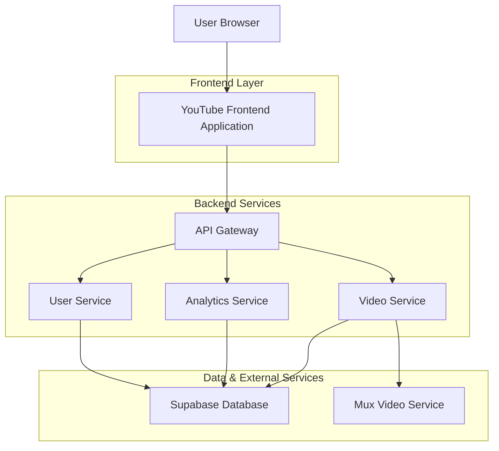
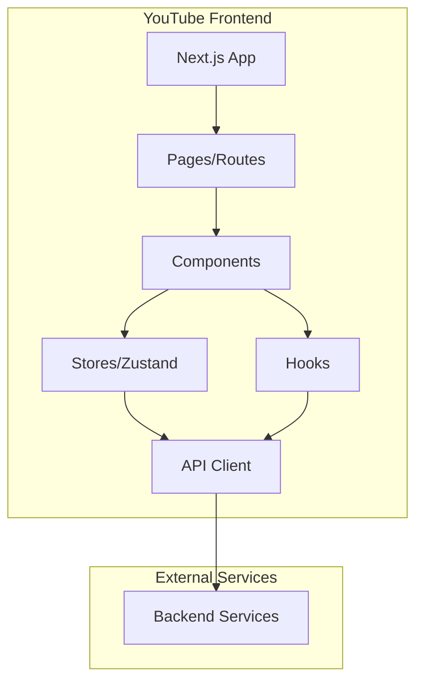
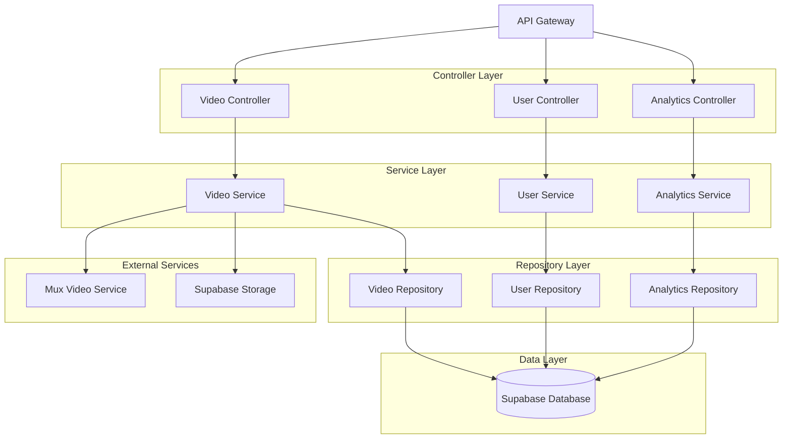
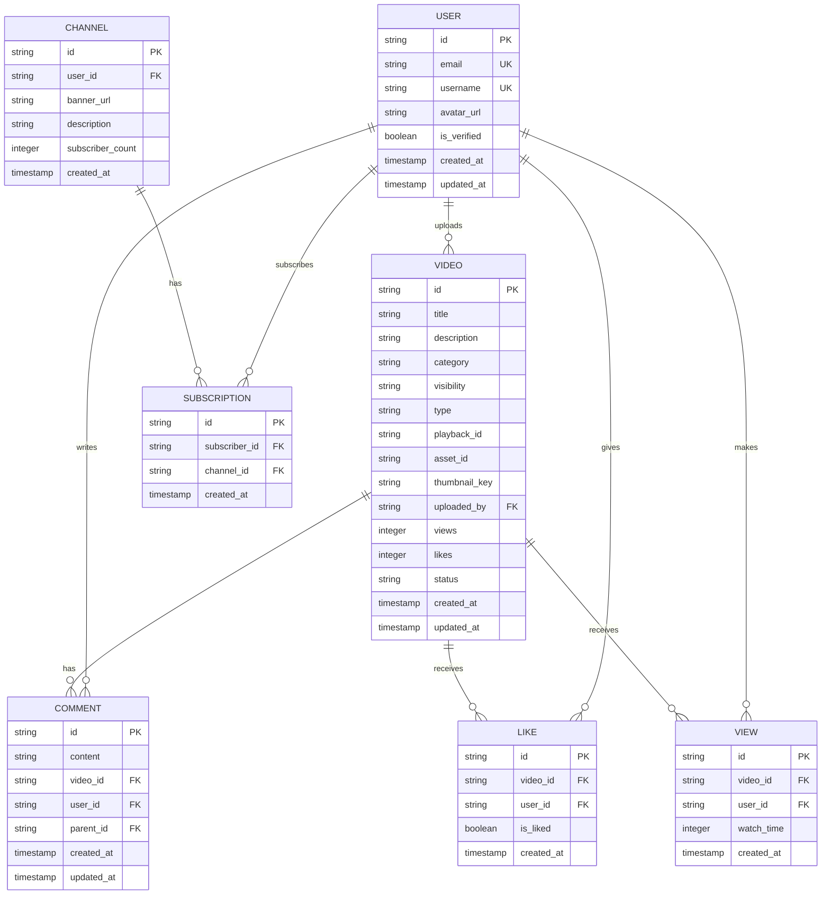

## 1. Architecture Design

### System Architecture Overview


### Frontend Architecture


## 2. Technology Description

### Frontend Stack
- **Framework**: Next.js 15.5.4 with React 19.1.1
- **Styling**: Tailwind CSS 4.1.13 with PostCSS
- **State Management**: Zustand 5.0.8 with persistence
- **UI Components**: Custom component library (@workspace/ui)
- **Video Player**: Mux Player React 3.8.0
- **Upload**: Mux Uploader React 1.3.0
- **HTTP Client**: Axios 1.12.2
- **Virtualization**: Tanstack React Virtual 3.13.12
- **Animations**: Framer Motion 12.23.24
- **Icons**: Lucide React 0.544.0
- **Initialization Tool**: vite-init (default for React projects)

### Backend Stack
- **Runtime**: Node.js with Express.js
- **Database**: Supabase (PostgreSQL) via @workspace/database
- **Video Processing**: Mux Video Service
- **Authentication**: JWT-based with cookie sessions
- **File Storage**: Supabase object storage
- **Webhooks**: Mux webhook handling for video events

### Development Tools
- **Package Manager**: pnpm with workspace configuration
- **Linting**: ESLint with custom workspace configuration
- **TypeScript**: Full TypeScript support with strict mode
- **Build**: Turbo for monorepo management
- **Testing**: Jest and React Testing Library setup

## 3. Route Definitions

### Frontend Routes
| Route | Purpose | Page Component |
|-------|---------|----------------|
| / | Home page with video feed and trending content | app/page.tsx |
| /watch/[id] | Video detail page with player and related videos | app/watch/[id]/page.tsx |
| /upload | Video upload interface with drag-and-drop | app/upload/page.tsx |
| /shorts | Vertical shorts player with swipe navigation | app/shorts/page.tsx |
| /channel/[id] | Channel page with profile and video library | app/channel/[id]/page.tsx |
| /search | Search results with advanced filtering | app/search/page.tsx |
| /studio | Creator studio for video management | app/studio/page.tsx |
| /analytics | Channel analytics dashboard | app/analytics/page.tsx |
| /settings | Channel and account settings | app/settings/page.tsx |

### API Routes (Backend)
| Route | Method | Purpose |
|-------|--------|---------|
| /api/videos | GET | List videos with pagination and filtering |
| /api/videos | POST | Create new video metadata |
| /api/videos/[id] | GET | Get specific video details |
| /api/videos/[id] | PATCH | Update video metadata |
| /api/videos/[id] | DELETE | Delete video and associated data |
| /api/videos/shorts | GET | List short-form videos |
| /api/videos/upload | POST | Initialize direct upload to Mux |
| /api/videos/upload/finalize | POST | Finalize upload and create database record |
| /api/videos/[id]/view | POST | Track video view for analytics |
| /api/videos/[id]/like | POST | Toggle video like status |
| /api/videos/webhook | POST | Handle Mux webhook events |
| /api/channels/[id] | GET | Get channel information |
| /api/channels/[id]/videos | GET | Get channel's video library |
| /api/search | GET | Search videos with filters |

## 4. API Definitions

### Core Video APIs

#### Initialize Video Upload
```
POST /api/videos/upload
```

Request:
| Param Name | Param Type | isRequired | Description |
|------------|-------------|-------------|-------------|
| fileSize | number | true | File size in bytes (max 128MB) |
| fileName | string | true | Original filename with extension |
| fileType | string | true | MIME type of video file |

Response:
| Param Name | Param Type | Description |
|------------|-------------|-------------|
| url | string | Direct upload URL for Mux |
| id | string | Upload session ID |

Example:
```json
{
  "fileSize": 52428800,
  "fileName": "my-video.mp4",
  "fileType": "video/mp4"
}
```

#### Finalize Video Upload
```
POST /api/videos/upload/finalize
```

Request:
| Param Name | Param Type | isRequired | Description |
|------------|-------------|-------------|-------------|
| title | string | true | Video title (max 100 chars) |
| description | string | false | Video description (max 5000 chars) |
| category | string | false | Video category (gaming, music, etc.) |
| visibility | string | true | public, private, or unlisted |
| type | string | true | video or short |
| thumbnailKey | string | false | Thumbnail file key |
| assetId | string | true | Mux asset ID |
| playbackId | string | true | Mux playback ID |

#### Track Video View
```
POST /api/videos/[id]/view
```

Response:
| Param Name | Param Type | Description |
|------------|-------------|-------------|
| message | string | Success confirmation |
| views | number | Updated view count |

#### Toggle Video Like
```
POST /api/videos/[id]/like
```

Request:
| Param Name | Param Type | isRequired | Description |
|------------|-------------|-------------|-------------|
| liked | boolean | true | true to like, false to unlike |

Response:
| Param Name | Param Type | Description |
|------------|-------------|-------------|
| message | string | Success confirmation |
| likes | number | Updated like count |

## 5. Server Architecture Diagram

### Service Layer Architecture


## 6. Data Model

### 6.1 Database Entity Relationships


### 6.2 Data Definition Language

#### Users Table
```sql
-- Create users table (extends existing auth.users)
CREATE TABLE user_profiles (
  id UUID PRIMARY KEY REFERENCES auth.users(id) ON DELETE CASCADE,
  username VARCHAR(50) UNIQUE NOT NULL,
  avatar_url VARCHAR(500),
  is_verified BOOLEAN DEFAULT FALSE,
  bio TEXT,
  created_at TIMESTAMP WITH TIME ZONE DEFAULT NOW(),
  updated_at TIMESTAMP WITH TIME ZONE DEFAULT NOW()
);

-- Create index for username search
CREATE INDEX idx_user_profiles_username ON user_profiles(username);
CREATE INDEX idx_user_profiles_verified ON user_profiles(is_verified);
```

#### Videos Table
```sql
-- Create videos table
CREATE TABLE videos (
  id UUID PRIMARY KEY DEFAULT gen_random_uuid(),
  title VARCHAR(100) NOT NULL,
  description TEXT,
  category VARCHAR(50),
  visibility VARCHAR(20) DEFAULT 'public' CHECK (visibility IN ('public', 'private', 'unlisted')),
  type VARCHAR(20) DEFAULT 'video' CHECK (type IN ('video', 'short')),
  playback_id VARCHAR(100),
  asset_id VARCHAR(100),
  thumbnail_key VARCHAR(500),
  uploaded_by UUID REFERENCES auth.users(id) ON DELETE CASCADE,
  views INTEGER DEFAULT 0,
  likes INTEGER DEFAULT 0,
  status VARCHAR(20) DEFAULT 'processing' CHECK (status IN ('processing', 'ready', 'failed')),
  duration INTEGER, -- in seconds
  created_at TIMESTAMP WITH TIME ZONE DEFAULT NOW(),
  updated_at TIMESTAMP WITH TIME ZONE DEFAULT NOW()
);

-- Create indexes for performance
CREATE INDEX idx_videos_uploaded_by ON videos(uploaded_by);
CREATE INDEX idx_videos_category ON videos(category);
CREATE INDEX idx_videos_visibility ON videos(visibility);
CREATE INDEX idx_videos_type ON videos(type);
CREATE INDEX idx_videos_status ON videos(status);
CREATE INDEX idx_videos_created_at ON videos(created_at DESC);
CREATE INDEX idx_videos_views ON videos(views DESC);
CREATE INDEX idx_videos_likes ON videos(likes DESC);

-- Full text search index
CREATE INDEX idx_videos_search ON videos USING gin(to_tsvector('english', title || ' ' || COALESCE(description, '')));
```

#### Comments Table
```sql
-- Create comments table
CREATE TABLE comments (
  id UUID PRIMARY KEY DEFAULT gen_random_uuid(),
  content TEXT NOT NULL,
  video_id UUID REFERENCES videos(id) ON DELETE CASCADE,
  user_id UUID REFERENCES auth.users(id) ON DELETE CASCADE,
  parent_id UUID REFERENCES comments(id) ON DELETE CASCADE,
  is_edited BOOLEAN DEFAULT FALSE,
  created_at TIMESTAMP WITH TIME ZONE DEFAULT NOW(),
  updated_at TIMESTAMP WITH TIME ZONE DEFAULT NOW()
);

-- Create indexes for comment queries
CREATE INDEX idx_comments_video_id ON comments(video_id);
CREATE INDEX idx_comments_user_id ON comments(user_id);
CREATE INDEX idx_comments_parent_id ON comments(parent_id);
CREATE INDEX idx_comments_created_at ON comments(created_at DESC);
```

#### Views Table
```sql
-- Create views tracking table
CREATE TABLE video_views (
  id UUID PRIMARY KEY DEFAULT gen_random_uuid(),
  video_id UUID REFERENCES videos(id) ON DELETE CASCADE,
  user_id UUID REFERENCES auth.users(id) ON DELETE CASCADE,
  watch_time INTEGER DEFAULT 0, -- seconds watched
  completed BOOLEAN DEFAULT FALSE,
  created_at TIMESTAMP WITH TIME ZONE DEFAULT NOW()
);

-- Create unique constraint to prevent duplicate views
CREATE UNIQUE INDEX idx_video_views_unique ON video_views(video_id, user_id);
CREATE INDEX idx_video_views_video_id ON video_views(video_id);
CREATE INDEX idx_video_views_user_id ON video_views(user_id);
CREATE INDEX idx_video_views_created_at ON video_views(created_at DESC);
```

#### Likes Table
```sql
-- Create likes table
CREATE TABLE video_likes (
  id UUID PRIMARY KEY DEFAULT gen_random_uuid(),
  video_id UUID REFERENCES videos(id) ON DELETE CASCADE,
  user_id UUID REFERENCES auth.users(id) ON DELETE CASCADE,
  is_liked BOOLEAN NOT NULL,
  created_at TIMESTAMP WITH TIME ZONE DEFAULT NOW(),
  updated_at TIMESTAMP WITH TIME ZONE DEFAULT NOW()
);

-- Create unique constraint for one like per user per video
CREATE UNIQUE INDEX idx_video_likes_unique ON video_likes(video_id, user_id);
CREATE INDEX idx_video_likes_video_id ON video_likes(video_id);
CREATE INDEX idx_video_likes_user_id ON video_likes(user_id);
```

### 6.3 Row Level Security (RLS) Policies

#### Videos Table Policies
```sql
-- Enable RLS
ALTER TABLE videos ENABLE ROW LEVEL SECURITY;

-- Public videos are viewable by everyone
CREATE POLICY "Public videos are viewable by everyone" ON videos
  FOR SELECT USING (visibility = 'public' AND status = 'ready');

-- Users can view their own videos regardless of visibility
CREATE POLICY "Users can view own videos" ON videos
  FOR SELECT USING (auth.uid() = uploaded_by);

-- Authenticated users can upload videos
CREATE POLICY "Authenticated users can upload videos" ON videos
  FOR INSERT WITH CHECK (auth.uid() = uploaded_by);

-- Users can update their own videos
CREATE POLICY "Users can update own videos" ON videos
  FOR UPDATE USING (auth.uid() = uploaded_by);

-- Users can delete their own videos
CREATE POLICY "Users can delete own videos" ON videos
  FOR DELETE USING (auth.uid() = uploaded_by);
```

#### Grant Permissions
```sql
-- Grant basic permissions
GRANT SELECT ON videos TO anon;
GRANT SELECT ON videos TO authenticated;
GRANT INSERT ON videos TO authenticated;
GRANT UPDATE ON videos TO authenticated;
GRANT DELETE ON videos TO authenticated;

-- Grant permissions for related tables
GRANT SELECT ON user_profiles TO anon;
GRANT SELECT ON user_profiles TO authenticated;
GRANT SELECT ON comments TO anon;
GRANT SELECT ON comments TO authenticated;
GRANT INSERT ON comments TO authenticated;
GRANT UPDATE ON comments TO authenticated;
GRANT DELETE ON comments TO authenticated;
```

## 7. Migration Strategy

### Phase 1: Project Setup
1. Create new youtube project structure in apps directory
2. Copy and adapt package.json and configuration files
3. Set up build pipeline and development environment

### Phase 2: Code Migration
1. Migrate all mux-related frontend code to youtube project
2. Update imports and references to use youtube project structure
3. Migrate server-side video controller and routes

### Phase 3: Integration Testing
1. Test all video functionality in isolated youtube environment
2. Verify no broken references in web project
3. Ensure clean separation between projects

### Phase 4: Deployment Preparation
1. Configure separate deployment pipeline for youtube project
2. Set up environment variables and service configurations
3. Prepare production build and deployment scripts