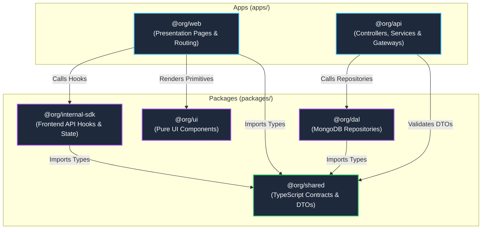

# Full-Stack Monorepo Boilerplate (Nx, NestJS, React 19, MongoDB)

Welcome to the **Full-Stack Monorepo Boilerplate**. This workspace is designed as a scalable, enterprise-grade foundation for building modern web applications using **TypeScript**, **React 19**, **Vite**, **NestJS 11**, **MongoDB (Mongoose)**, **Socket.IO**, **Tailwind CSS**, and **TanStack Query**.

---

## 🏗️ Architectural Blueprint

This monorepo follows a **strict modular separation of concerns**. The workspace is divided into end-user **Applications (`apps/`)** and decoupled, reusable **Libraries (`packages/`)**.

```
monorepo/
├── apps/
│   ├── api/          (@org/api)          — Real-time backend API server (NestJS 11 + Fastify)
│   └── web/          (@org/web)          — Responsive frontend SPA (React 19 + Vite)
└── packages/
    ├── shared/       (@org/shared)       — Single source of truth for TypeScript types, DTOs & domain contracts
    ├── dal/          (@org/dal)          — Data Access Layer for MongoDB (Mongoose Repositories & Entities)
    ├── internal-sdk/ (@org/internal-sdk) — Frontend API client, TanStack Query hooks & Auth state provider
    └── ui/           (@org/ui)           — Shared React UI component library & Tailwind CSS design system
```

---

## 🔗 Unidirectional Dependency Flow

To keep code maintainable, testable, and clean as your project grows, **strictly follow the dependency rules below**:



---

## 🧭 Where Should You Put Your Code?

When adding new features to your project, use this guide to decide where code belongs:

| What you are building | Where it belongs | Why? |
| :--- | :--- | :--- |
| **API Request / Response Shapes** | `packages/shared` | Shares identical TypeScript interfaces between frontend query mutations and backend controller validation. |
| **Database Schemas & Queries** | `packages/dal` | Isolates Mongoose/MongoDB so backend services never deal with raw database driver internals. |
| **Frontend API Calls & Caching** | `packages/internal-sdk` | Keeps TanStack Query hooks and HTTP logic reusable across any frontend page or view. |
| **Reusable UI Elements** | `packages/ui` | Keeps buttons, cards, modals, and form inputs decoupled from business logic. |
| **Business Logic & REST Endpoints** | `apps/api` | Houses NestJS Controllers, Services, WebSockets, and authentication workflows. |
| **Pages, Layouts & App Routing** | `apps/web` | Focuses purely on visual composition, page layouts, and React Router navigation. |

---

## ⚡ Development & Hot-Reloading Strategy

This workspace is configured with TypeScript package exports (`@org/source` condition in `tsconfig.base.json`):

- **Instant Hot-Reloading**: Modifying code in `packages/shared`, `packages/dal`, `packages/internal-sdk`, or `packages/ui` immediately updates `apps/api` and `apps/web` without requiring a manual rebuild.
- **No Manual Build Steps**: Never run `pnpm nx build` on library packages during local development.

---

## 🛠️ Common Commands

All commands are orchestrated via the `nx` CLI:

```bash
# Start backend API and frontend Web development servers
pnpm nx dev @org/api
pnpm nx dev @org/web

# Typecheck the entire workspace
pnpm nx run-many -t typecheck

# Check MongoDB connectivity
pnpm nx check-db @org/api

# Open interactive dependency graph
pnpm nx graph
```
